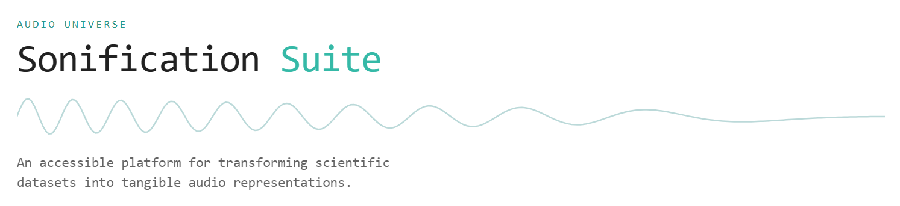

# Sonification Suite for Planetaria (Alpha)



## Live Demo

Try the Alpha version online: [https://sonificationsuite.ncl.ac.uk](https://sonificationsuite.ncl.ac.uk)  

## Tech Stack

- **Frontend:** React, TypeScript, Vite  
- **Backend:** Python, FastAPI  
- **Astronomy Data:** `astroquery`, `lightkurve`, `skyfield`  
- **Sonification:** `STRAUSS`

## Getting Started (Local Setup)

### Prerequisites

- Node.js >= 20  
- Python >= 3.11  
- `pip` package manager  

### Installation

1. **Clone the repository**

```bash
git clone https://github.com/gcaselton/sonification-toolkit.git
```

2. **Setup and run the backend**

Navigate to the location you cloned the repo, then

```bash
pip install .

cd src/backend

uvicorn main:app
```

The FastAPI server should be running at http://127.0.0.1:8000

You can find the documentation of the API available at http://127.0.0.1:8000/docs

3. **Setup and run the frontend**

Open a new terminal and navigate to the project root, then

```bash
cd src/frontend

npm install

npm run dev
```

Open a web browser window and navigate to http://localhost:5173/


